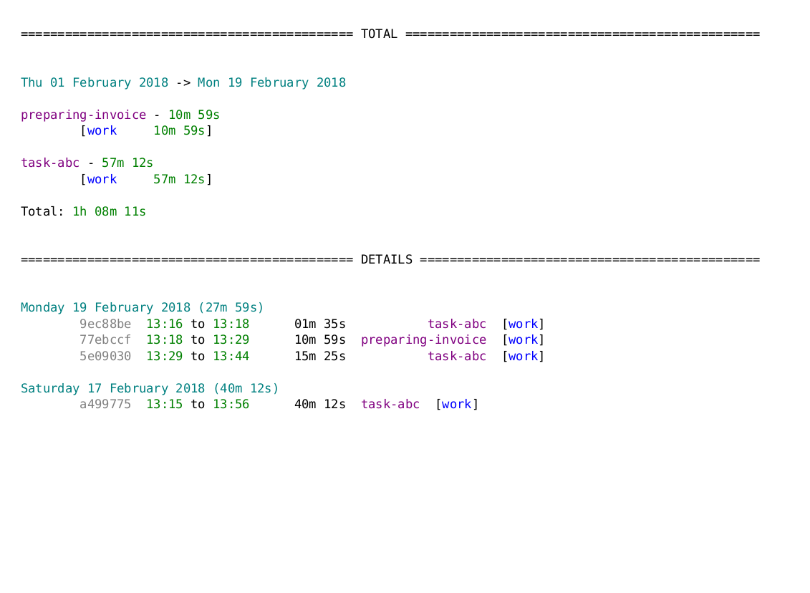

# Watson timesheet

A script for generating PDF timesheets using [Watson](https://tailordev.github.io/Watson/).
Combines output from `watson report` and `watson log`, while keeping the text fully colored.

## Dependencies

- `watson` (obviously)
- `expect` (for interaction with `watson` and keeping the colors)
- `aha` (for exporting the output to HTML)
- `wkhtmltopdf` (for converting the report file to PDF)

Those can be installed with 2 commands:
- `pip install --user td-watson`
- `sudo apt install expect aha wkhtmltopdf`

## Usage

`./generate-watson-timesheet.sh [file]`

Each line of `file` should contain a name of the target file and an associated tag name (e.g. `remote worked-hours-remote`). Report will be generated for all tasks in the current month that have `tag` assigned
to them. The output file will be named `timesheet-[current_year]-[current_month]-[target_file_name].pdf`.

## Example

Command:

`./generate-watson-timesheet.sh work.txt`

Output file name:

`timesheet-2018-02-remote.pdf`

Output preview:

